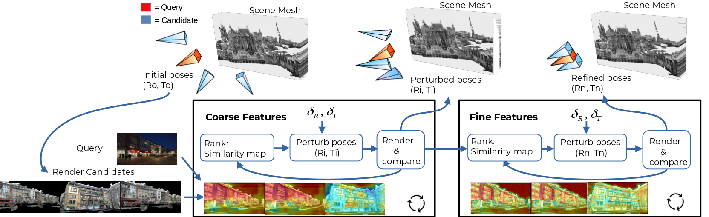

# The Unreasonable Effectiveness of Pre-Trained Features for Camera Pose Refinement

This is the official pyTorch implementation of the CVPR24 paper "The Unreasonable Effectiveness of Pre-Trained Features for Camera Pose Refinement".
In this work, we present a simple approach for Pose Refinement that combines pre-trained features with a particle filter and a renderable representation of the scene. 


[[CVPR 2024 Open Access](https://openaccess.thecvf.com/content/CVPR2024/html/Trivigno_The_Unreasonable_Effectiveness_of_Pre-Trained_Features_for_Camera_Pose_Refinement_CVPR_2024_paper.html)] [[ArXiv](https://arxiv.org/abs/2404.10438)]

<p align="center">
  
    <br/><em>Our proposed Pose Refinement algorithm.</em>
</p>

## Download data

The following command

`$ python download.py`

Will download colmap models, and pre-trained Splatting models for the scene representation, as well as the Cambridge Landmark dataset.

## Environment

Follow the instructions to install the `gaussian_splatting` environment from the [official repo](https://github.com/graphdeco-inria/gaussian-splatting/tree/main?tab=readme-ov-file#setup)

Then, activate the environment and execute:

`$ pin install -r requirements.txt`

## Reproduce our results

### Cambridge Landmarks

To reproduce results on Cambridge Landmarks, e.g. for KingsCollege:

`$ python refine_pose.py KingsCollege --exp_name kings_college_refine --renderer g_splatting --clean_logs`

The script will load the config for the number of steps and hyperparameters of the MonteCarlo optimization from the `configs.py` file. It will utilize a Gaussian Splatting model to render candidate poses. Other options such as a colored mesh, or a NeRF model will be uploaded soon

### 7scenes

Coming soon

### Aachen Day-Night

Coming soon

## Cite
Here is the bibtex to cite our paper
```@inproceedings{trivigno2024unreasonable,
  title={The Unreasonable Effectiveness of Pre-Trained Features for Camera Pose Refinement},
  author={Trivigno, Gabriele and Masone, Carlo and Caputo, Barbara and Sattler, Torsten},
  booktitle={Proceedings of the IEEE/CVF Conference on Computer Vision and Pattern Recognition},
  pages={12786--12798},
  year={2024}
}
```


## Acknowledgements
Parts of this repo are inspired by the following repositories:
- [Gaussian Splatting](https://github.com/graphdeco-inria/gaussian-splatting)
- [Nerfstudio](https://github.com/nerfstudio-project/nerfstudio)
